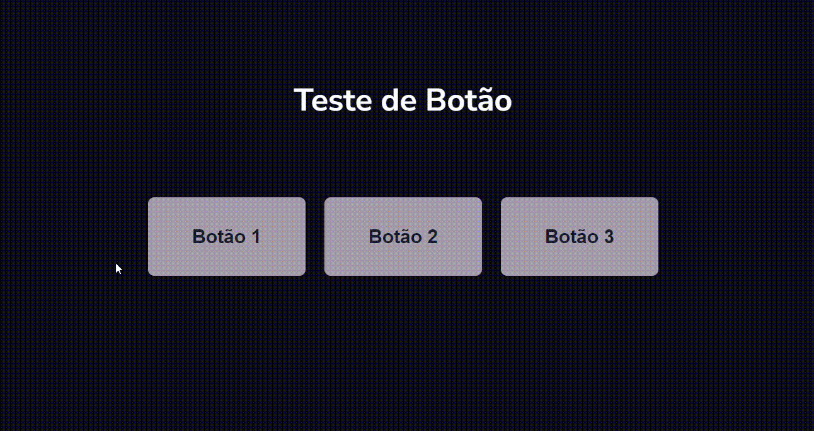
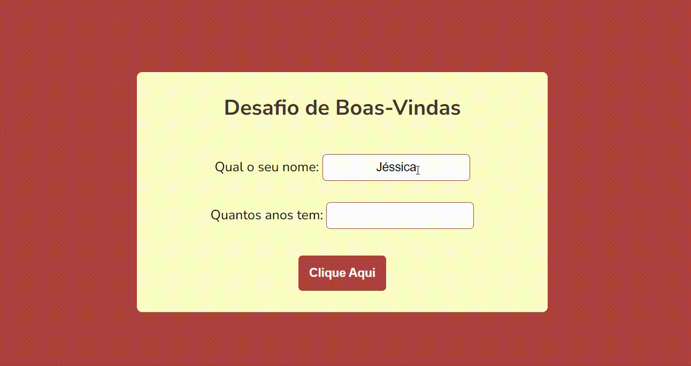

# Curso Javascript Guanabara

Curso de Js Gustavo Guanabara, estou me desafiando e criando o html e css simples (também aprendendo), e ao invês de utilizar o alert como o desafio propoe estou fazendo com que altere o texto na tela, assim ficando mais intuitivo.

---

- **Desafio 1**

  - Clicar em um botão e aparecer a mensagem que clicou no botão.

  

---

- **Desafio 2**
  - Digitar o nome e idade e aparecer mensagem de "Prazer em conhecer"

---

- **Desafio 3**

  - Digitar um número e aparecer o seu antecessor e sucessor.

  

---

- **Desafio 4**

  - Digitar o nome do produto, valor do produto e valor pago, informar uma mensagem com o total do troco.

  

---

- **Desafio 5**
  - :construction: :construction: :construction:
